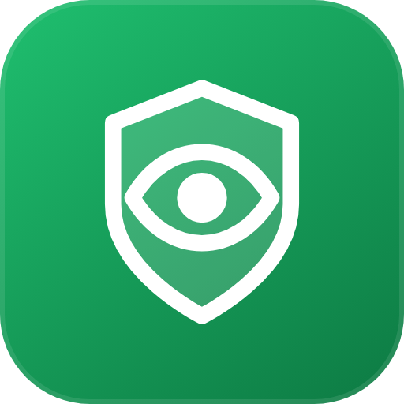

<p align="center">
  
</p>

<h1 align="center">Vaka</h1>

<p align="center">
  <b>The safe Swedish browser.</b><br>
  Built-in protection that no extension policy can switch off, family features that are open instead of secret, and an AI security assistant one click away.
</p>

<p align="center">
  <a href="https://github.com/northcrafto/vaka-dl/releases/latest"></a>
  <a href="https://github.com/northcrafto/vaka-dl/releases"></a>
  <a href="LICENSE"></a>
  
</p>

<p align="center">
  <a href="https://vaka-web-lovat.vercel.app/win"><b>Download for Windows</b></a> ·
  <a href="https://vaka-web-lovat.vercel.app/mac"><b>macOS (Apple Silicon)</b></a> ·
  <a href="https://vaka-web-lovat.vercel.app/mac-intel"><b>macOS (Intel)</b></a> ·
  <a href="https://vaka-web-lovat.vercel.app/linux"><b>Linux</b></a>
</p>

<p align="center">
  
</p>

---

## Why Vaka exists

Most people never install an ad blocker, never check a link before clicking it, and never find out that their password leaked. Vaka is for them. Protection is on from the first launch, it cannot be disabled by a browser vendor's extension policy, and nothing you do is sent anywhere to make it work.

Vaka is built in Sweden, in Swedish first, and speaks 54 languages.

## What you get

**Brave's ad blocker, built into the browser.**
Vaka runs [adblock-rust](https://github.com/brave/adblock-rust), the same Rust engine that powers Brave Shields, through Brave's official Node binding. It loads Brave's default filter set (EasyList, EasyPrivacy, the uBlock Origin lists, Brave's own lists, URLhaus malware domains) plus a small Vaka list, applies cosmetic filters and uBlock Origin scriptlets, serves stub resources so pages don't break, and enforces the lists' popup rules against pop-unders. It is not a Chrome extension, so Manifest V3 does not apply to it.

**A warning before the page loads, not after.**
Dangerous addresses are checked against Säkerkoll's threat data and known-bad patterns. If a page looks like a scam, Vaka shows a full-screen warning with the reasons before anything renders. Download scanning catches the rest.

**Krypto — an AI security assistant in the sidebar.**
Ask "is this site legit?", "what does this permission mean?" or "how do I set up a password manager?" and get a plain-language answer. Krypto can also change browser settings for you. Part of Vaka Pro.

**Vaka Family — open, not spying.**
Parents create child accounts with a short code. The child always sees that a parent can view history; nothing happens behind their back. Parents get an email when someone logs in on the child's account, can log the child out remotely, and can rotate the code.

**Vaka Wallet and password manager — zero knowledge.**
Cards and passwords are encrypted with AES-256-GCM on the device. The key lives in the operating system's keychain. We cannot read them, and neither can anyone who copies your disk.

**Private search when you go incognito.**
Incognito tabs search through Vaka Sök, our own SearXNG-based engine with no logs, and get their suggestions from it too.

**The boring but important parts.**
Memory saver that discards idle tabs, Widevine so Netflix and SVT Play work, an address bar with suggestions and history completion, automatic updates on Linux and Windows.

## Sister browsers

Vaka shares its code with three siblings, each built for a different kind of user:

| Browser | For whom |
| --- | --- |
| [Prowl](https://github.com/vaka-browser/prowl) | Security researchers and bug bounty hunters. Same engine, hacker tooling, dark by default. |
| Skugga | Everything through Tor, fail-closed, WebRTC locked. |
| Forget | Tor plus amnesia: the whole profile lives in RAM and is wiped on exit. |

## Build from source

You need Node.js 22 or newer.

```bash
git clone https://github.com/vaka-browser/vaka.git
cd vaka
npm install
npm start
```

`npm install` downloads the castLabs build of Electron (Chromium with Widevine). Everything else is plain JavaScript with no compile step.

The ad-blocking engine is a native module (Brave's `adblock-rs`). Prebuilt binaries for Linux x64, Windows x64, macOS Apple Silicon and macOS Intel live in `native/adblock/` and are built by the `adblock-native` GitHub Actions workflow, so you do not need a Rust toolchain to run or package Vaka. To rebuild them, run the workflow (or `npm install adblock-rs` with Rust installed) and copy `index.node` into the matching folder.

### Packaging

| Target | Command |
| --- | --- |
| Linux AppImage | `npx electron-builder --linux --x64 --publish never` |
| Windows installer | `npx electron-builder --win --x64 --publish never -c.electronDist=<dir with castLabs zips>` |
| macOS app | `npm run build:mac` (Intel) or add `--arch=arm64` for Apple Silicon; run on a Mac |

Windows and macOS packages can be VMP-signed for Widevine by `build/afterPack.js` if you have a castLabs EVS account. Without one the build still succeeds; only DRM playback is disabled on those platforms.

The shell's CSS is compiled with Tailwind from `ui/input.css`:

```bash
node_modules/.bin/tailwindcss -i ui/input.css -o ui/tailwind.css --minify
```

## How the code is organised

```
main.js              Electron main process: windows, tabs, IPC
adblock-brave.js     Brave's adblock-rust engine: lists, cache, network blocking, popup rules
adblock-preload.js   Cosmetic filtering inside pages (hide rules, generic class/id hiding, scriptlets)
native/adblock/      Prebuilt adblock-rs binaries per platform
preload.js           Bridge between the shell UI and the main process
content-preload.js   Runs inside pages: password/card detection, autofill, cosmetics
scanner.js           Dangerous-site checks and content analysis
auth.js              Account sessions
ui/                  Shell (shell.html/js), Krypto panel, settings, checkout
filters/             Filter lists for the protection engine
tools/               Filter updates and translation generation
build/               Icons and packaging hooks
```

The account, family and Krypto features talk to a hosted backend. Browsing, protection, the wallet and the password manager work fully offline without an account.

## Roadmap

- Native Apple Silicon and Intel builds on every release (done since 0.3.79).
- Signed and notarised macOS builds.
- Tab groups and vertical tabs.
- Sync of bookmarks and settings between devices, end-to-end encrypted.
- More languages for Krypto.

Have an idea? [Open an issue](https://github.com/vaka-browser/vaka/issues/new/choose).

## Contributing

Bug reports, translations, filter fixes and code are all welcome. Read [CONTRIBUTING.md](CONTRIBUTING.md) for the setup and the rules, and [CODE_OF_CONDUCT.md](CODE_OF_CONDUCT.md) for how we treat each other.

Found a security problem? Please report it privately — see [SECURITY.md](SECURITY.md).

## Contributors

<a href="https://github.com/vaka-browser/vaka/graphs/contributors">
  
</a>

## License

Vaka is released under the [Mozilla Public License 2.0](LICENSE). You can use, modify and redistribute it, including in commercial products, as long as changes to MPL-covered files stay under the MPL.

Filter lists in `filters/` keep their own licenses (EasyList and Fanboy lists: GPLv3 / CC BY-SA 3.0; uBlock Origin lists: GPLv3; Brave lists: MPL-2.0; URLhaus: CC0). The ad-blocking engine adblock-rust is MPL-2.0 (Brave Software). Electron and Chromium are covered by their respective licenses.

---

<p align="center">Made in Sweden.</p>
